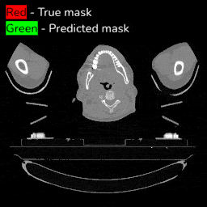

# Medical Image Segmentation Project
Segmentation is crucial part of the radiotherapy process for cancer patients. In radiotherapy, beams of radiation are used to kill cancerous cells. In order to develop an effect radiotherapy plan, it is imperative to have an accurate segmentation of both target tumors and surrounding organs. The better the segmentations, the more targeted the radiotherapy can be, thereby minimizing damage to healthy tissue.

In this repository we focus on using deep learning (specifically U-Net based architectures) to implement a model for automated organ segmentation. At this stage, the lung has been the focus of this project.

## Prerequisites
Install [Docker Desktop](https://www.docker.com/products/docker-desktop)

## Setup and Usage
1. Clone the repository to your local machine
2. `docker build -t medical-image-segmentation medical_segmentation/`
3. `docker run -p 8888:8888 -it medical-image-segmentation`
4. Navigate to the [Jupyter notebook](http://localhost:8888).
5. Open `training_segmentation_model.ipynb`
6. Run the notebook

## Acknowledgements

This repository was developed in the summer of 2021 by two CTG interns, [David Wu](https://github.com/david-wu-dev) and [Chemda Wiener](https://github.com/ctw599).

Special thank you to Dr. Raymond Mak and Ahmed Hosny for their support and advice in developing this project.
